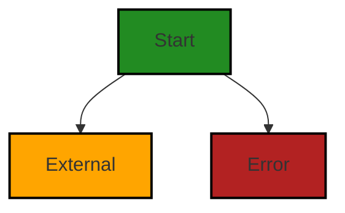

# Polyverse Boost-generated Source Analysis Details

## Source: ./README.md
Date Generated: Saturday, October 21, 2023 at 12:23:48 PM PDT


---

### Boost Architectural Quick Summary Security Report

Last Updated: Saturday, October 21, 2023 at 12:23:24 PM PDT


Executive Report:

1. **Architectural Impact**: The analysis of this file has not revealed any severe issues.
2. **Risk Analysis**: The analysis of this file has not revealed any severe issues.
3. **Potential Customer Impact**: Based on the analysis, there are no severe issues that could potentially impact customers.
4. **Performance Issues**: Our analysis did not identify any explicit performance issues in the file.
5. **Risk Assessment**: Based on the current analysis of this file, no severe issues have been found. However, this doesn't guarantee that the file is risk-free.

Highlights:

- No severe issues were identified in the current analysis of this file.


---

### Boost Architectural Quick Summary Performance Report

Last Updated: Saturday, October 21, 2023 at 12:23:38 PM PDT


Executive Report:

1. **Architectural Impact**: The analysis of this file has not revealed any severe issues.
2. **Risk Analysis**: The analysis of this file has not revealed any severe issues.
3. **Potential Customer Impact**: Based on the analysis, there are no severe issues that could potentially impact customers.
4. **Performance Issues**: Our analysis did not identify any explicit performance issues in the file.
5. **Risk Assessment**: Based on the current analysis of this file, no severe issues have been found. However, this doesn't guarantee that the file is risk-free.

Highlights:

- No severe issues were identified in the current analysis of this file.


---

### Boost Architectural Quick Summary Compliance Report

Last Updated: Saturday, October 21, 2023 at 12:23:52 PM PDT


Executive Report:

1. **Architectural Impact**: The analysis of this file has not revealed any severe issues.
2. **Risk Analysis**: The analysis of this file has not revealed any severe issues.
3. **Potential Customer Impact**: Based on the analysis, there are no severe issues that could potentially impact customers.
4. **Performance Issues**: Our analysis did not identify any explicit performance issues in the file.
5. **Risk Assessment**: Based on the current analysis of this file, no severe issues have been found. However, this doesn't guarantee that the file is risk-free.

Highlights:

- No severe issues were identified in the current analysis of this file.

---
## Detailed Analysis:

### Cell 0:
## Original Code:

### Programming Language: markdown
### ./README.md 

```markdown
# Sample Programs in Cobol

Welcome to Sample Programs in Cobol! To find documentation related to the Cobol code in this repo, look [here.](https://sampleprograms.io/languages/cobol)

## Sample Programs List - 4/37 :disappointed:

In this section, we feature a list of completed and missing programs in Cobol. See above for the current amount of completed programs in Cobol. If you see a program that is missing and would like to add it, please submit an issue, so we can assign it to you.

### Completed Programs

Below, you'll find a list of completed code snippets in Cobol. Code snippets preceded by :warning: link to a GitHub issue query featuring a possible article request issue. If an article request issue doesn't exist, we encourage you to create one. Meanwhile, code snippets preceded by :white_check_mark: link to an existing article which provides further documentation. To see the list of approved projects, check out the official Sample Programs projects list.

- :white_check_mark: [Even Odd in Cobol](https://sampleprograms.io/projects/even-odd/cobol) [[Requirements](https://sampleprograms.io/projects/even-odd)]
- :warning: [Factorial in Cobol](https://github.com//TheRenegadeCoder/sample-programs-website/issues?utf8=%E2%9C%93&q=is%3Aissue+is%3Aopen+factorial+cobol) [[Requirements](https://sampleprograms.io/projects/factorial)]
- :white_check_mark: [Hello World in Cobol](https://sampleprograms.io/projects/hello-world/cobol) [[Requirements](https://sampleprograms.io/projects/hello-world)]
- :warning: [Prime Number in Cobol](https://github.com//TheRenegadeCoder/sample-programs-website/issues?utf8=%E2%9C%93&q=is%3Aissue+is%3Aopen+prime+number+cobol) [[Requirements](https://sampleprograms.io/projects/prime-number)]

### Missing Programs

The following list contains all of the approved programs that are not currently implemented in Cobol. Click on the name of the project to easily open an issue in GitHub. Alternatively, click requirements to check out the description of the project.

- :x: [Baklava](https://github.com/TheRenegadeCoder/sample-programs/issues/new?assignees=&labels=enhancement,baklava&template=code-snippet-request.md&title=Add+Baklava+in+Cobol) [[Requirements](https://sampleprograms.io/projects/baklava)]
- :x: [Binary Search](https://github.com/TheRenegadeCoder/sample-programs/issues/new?assignees=&labels=enhancement,binary+search&template=code-snippet-request.md&title=Add+Binary+Search+in+Cobol) [[Requirements](https://sampleprograms.io/projects/binary-search)]
- :x: [Bubble Sort](https://github.com/TheRenegadeCoder/sample-programs/issues/new?assignees=&labels=enhancement,bubble+sort&template=code-snippet-request.md&title=Add+Bubble+Sort+in+Cobol) [[Requirements](https://sampleprograms.io/projects/bubble-sort)]
- :x: [Capitalize](https://github.com/TheRenegadeCoder/sample-programs/issues/new?assignees=&labels=enhancement,capitalize&template=code-snippet-request.md&title=Add+Capitalize+in+Cobol) [[Requirements](https://sampleprograms.io/projects/capitalize)]
- :x: [Convex Hull](https://github.com/TheRenegadeCoder/sample-programs/issues/new?assignees=&labels=enhancement,convex+hull&template=code-snippet-request.md&title=Add+Convex+Hull+in+Cobol) [[Requirements](https://sampleprograms.io/projects/convex-hull)]
- :x: [Depth First Search](https://github.com/TheRenegadeCoder/sample-programs/issues/new?assignees=&labels=enhancement,depth+first+search&template=code-snippet-request.md&title=Add+Depth+First+Search+in+Cobol) [[Requirements](https://sampleprograms.io/projects/depth-first-search)]
- :x: [Dijkstra](https://github.com/TheRenegadeCoder/sample-programs/issues/new?assignees=&labels=enhancement,dijkstra&template=code-snippet-request.md&title=Add+Dijkstra+in+Cobol) [[Requirements](https://sampleprograms.io/projects/dijkstra)]
- :x: [Duplicate Character Counter](https://github.com/TheRenegadeCoder/sample-programs/issues/new?assignees=&labels=enhancement,duplicate+character+counter&template=code-snippet-request.md&title=Add+Duplicate+Character+Counter+in+Cobol) [[Requirements](https://sampleprograms.io/projects/duplicate-character-counter)]
- :x: [Fibonacci](https://github.com/TheRenegadeCoder/sample-programs/issues/new?assignees=&labels=enhancement,fibonacci&template=code-snippet-request.md&title=Add+Fibonacci+in+Cobol) [[Requirements](https://sampleprograms.io/projects/fibonacci)]
- :x: [File Input Output](https://github.com/TheRenegadeCoder/sample-programs/issues/new?assignees=&labels=enhancement,file+input+output&template=code-snippet-request.md&title=Add+File+Input+Output+in+Cobol) [[Requirements](https://sampleprograms.io/projects/file-input-output)]
- :x: [Fizz Buzz](https://github.com/TheRenegadeCoder/sample-programs/issues/new?assignees=&labels=enhancement,fizz+buzz&template=code-snippet-request.md&title=Add+Fizz+Buzz+in+Cobol) [[Requirements](https://sampleprograms.io/projects/fizz-buzz)]
- :x: [Fraction Math](https://github.com/TheRenegadeCoder/sample-programs/issues/new?assignees=&labels=enhancement,fraction+math&template=code-snippet-request.md&title=Add+Fraction+Math+in+Cobol) [[Requirements](https://sampleprograms.io/projects/fraction-math)]
- :x: [Insertion Sort](https://github.com/TheRenegadeCoder/sample-programs/issues/new?assignees=&labels=enhancement,insertion+sort&template=code-snippet-request.md&title=Add+Insertion+Sort+in+Cobol) [[Requirements](https://sampleprograms.io/projects/insertion-sort)]
- :x: [Job Sequencing](https://github.com/TheRenegadeCoder/sample-programs/issues/new?assignees=&labels=enhancement,job+sequencing&template=code-snippet-request.md&title=Add+Job+Sequencing+in+Cobol) [[Requirements](https://sampleprograms.io/projects/job-sequencing)]
- :x: [Josephus Problem](https://github.com/TheRenegadeCoder/sample-programs/issues/new?assignees=&labels=enhancement,josephus+problem&template=code-snippet-request.md&title=Add+Josephus+Problem+in+Cobol) [[Requirements](https://sampleprograms.io/projects/josephus-problem)]
- :x: [Linear Search](https://github.com/TheRenegadeCoder/sample-programs/issues/new?assignees=&labels=enhancement,linear+search&template=code-snippet-request.md&title=Add+Linear+Search+in+Cobol) [[Requirements](https://sampleprograms.io/projects/linear-search)]
- :x: [Longest Common Subsequence](https://github.com/TheRenegadeCoder/sample-programs/issues/new?assignees=&labels=enhancement,longest+common+subsequence&template=code-snippet-request.md&title=Add+Longest+Common+Subsequence+in+Cobol) [[Requirements](https://sampleprograms.io/projects/longest-common-subsequence)]
- :x: [Longest Palindromic Substring](https://github.com/TheRenegadeCoder/sample-programs/issues/new?assignees=&labels=enhancement,longest+palindromic+substring&template=code-snippet-request.md&title=Add+Longest+Palindromic+Substring+in+Cobol) [[Requirements](https://sampleprograms.io/projects/longest-palindromic-substring)]
- :x: [Longest Word](https://github.com/TheRenegadeCoder/sample-programs/issues/new?assignees=&labels=enhancement,longest+word&template=code-snippet-request.md&title=Add+Longest+Word+in+Cobol) [[Requirements](https://sampleprograms.io/projects/longest-word)]
- :x: [Maximum Array Rotation](https://github.com/TheRenegadeCoder/sample-programs/issues/new?assignees=&labels=enhancement,maximum+array+rotation&template=code-snippet-request.md&title=Add+Maximum+Array+Rotation+in+Cobol) [[Requirements](https://sampleprograms.io/projects/maximum-array-rotation)]
- :x: [Maximum Subarray](https://github.com/TheRenegadeCoder/sample-programs/issues/new?assignees=&labels=enhancement,maximum+subarray&template=code-snippet-request.md&title=Add+Maximum+Subarray+in+Cobol) [[Requirements](https://sampleprograms.io/projects/maximum-subarray)]
- :x: [Merge Sort](https://github.com/TheRenegadeCoder/sample-programs/issues/new?assignees=&labels=enhancement,merge+sort&template=code-snippet-request.md&title=Add+Merge+Sort+in+Cobol) [[Requirements](https://sampleprograms.io/projects/merge-sort)]
- :x: [Minimum Spanning Tree](https://github.com/TheRenegadeCoder/sample-programs/issues/new?assignees=&labels=enhancement,minimum+spanning+tree&template=code-snippet-request.md&title=Add+Minimum+Spanning+Tree+in+Cobol) [[Requirements](https://sampleprograms.io/projects/minimum-spanning-tree)]
- :x: [Palindromic Number](https://github.com/TheRenegadeCoder/sample-programs/issues/new?assignees=&labels=enhancement,palindromic+number&template=code-snippet-request.md&title=Add+Palindromic+Number+in+Cobol) [[Requirements](https://sampleprograms.io/projects/palindromic-number)]
- :x: [Quick Sort](https://github.com/TheRenegadeCoder/sample-programs/issues/new?assignees=&labels=enhancement,quick+sort&template=code-snippet-request.md&title=Add+Quick+Sort+in+Cobol) [[Requirements](https://sampleprograms.io/projects/quick-sort)]
- :x: [Quine](https://github.com/TheRenegadeCoder/sample-programs/issues/new?assignees=&labels=enhancement,quine&template=code-snippet-request.md&title=Add+Quine+in+Cobol) [[Requirements](https://sampleprograms.io/projects/quine)]
- :x: [Remove All Whitespace](https://github.com/TheRenegadeCoder/sample-programs/issues/new?assignees=&labels=enhancement,remove+all+whitespace&template=code-snippet-request.md&title=Add+Remove+All+Whitespace+in+Cobol) [[Requirements](https://sampleprograms.io/projects/remove-all-whitespace)]
- :x: [Reverse String](https://github.com/TheRenegadeCoder/sample-programs/issues/new?assignees=&labels=enhancement,reverse+string&template=code-snippet-request.md&title=Add+Reverse+String+in+Cobol) [[Requirements](https://sampleprograms.io/projects/reverse-string)]
- :x: [Roman Numeral](https://github.com/TheRenegadeCoder/sample-programs/issues/new?assignees=&labels=enhancement,roman+numeral&template=code-snippet-request.md&title=Add+Roman+Numeral+in+Cobol) [[Requirements](https://sampleprograms.io/projects/roman-numeral)]
- :x: [Rot13](https://github.com/TheRenegadeCoder/sample-programs/issues/new?assignees=&labels=enhancement,rot13&template=code-snippet-request.md&title=Add+Rot13+in+Cobol) [[Requirements](https://sampleprograms.io/projects/rot13)]
- :x: [Selection Sort](https://github.com/TheRenegadeCoder/sample-programs/issues/new?assignees=&labels=enhancement,selection+sort&template=code-snippet-request.md&title=Add+Selection+Sort+in+Cobol) [[Requirements](https://sampleprograms.io/projects/selection-sort)]
- :x: [Sleep Sort](https://github.com/TheRenegadeCoder/sample-programs/issues/new?assignees=&labels=enhancement,sleep+sort&template=code-snippet-request.md&title=Add+Sleep+Sort+in+Cobol) [[Requirements](https://sampleprograms.io/projects/sleep-sort)]
- :x: [Transpose Matrix](https://github.com/TheRenegadeCoder/sample-programs/issues/new?assignees=&labels=enhancement,transpose+matrix&template=code-snippet-request.md&title=Add+Transpose+Matrix+in+Cobol) [[Requirements](https://sampleprograms.io/projects/transpose-matrix)]

## Testing

The following list shares details about what we're using to test all Sample Programs in Cobol.

- Docker Image: esolang/cobol
- Docker Tag: latest

See the [Glotter2 project](https://github.com/rzuckerm/glotter2) for more information on how to create a testinfo file.

***

This page was generated automatically by the Sample Programs READMEs tool. Find out how to support [this project](https://github.com/TheRenegadeCoder/sample-programs-readmes) on Github.
```
## Boost Analysis:


---

### Boost Code Explanation

Last Updated: Saturday, October 21, 2023 at 12:23:00 PM PDT

This is not an executable code but rather a markdown document that serves as a guide or documentation for a repository of COBOL sample programs. It provides information on both completed and missing programs in the repository. 

The markdown document contains:

1. A welcome message and a link to documentation related to the COBOL code in the repository.

2. A list of completed programs with links to the code snippets and their requirements. The completed programs are marked with a white check mark or a warning sign, indicating whether an article request issue exists or not.

3. A list of missing programs along with links to open an issue in GitHub and check out the description of the project. The missing programs are marked with a cross.

4. Information on how the sample programs in COBOL are tested, including the Docker image and tag used.

5. A link to the Glotter2 project for more information on how to create a testinfo file.

6. A link to support the project on Github.

In terms of architecture, this document serves as a guide to both contributors and users of the repository, providing an overview of the current status of the project and how to contribute to it. 

As for the algorithms used, since this is a markdown document and not an executable code, we can't talk about algorithms. However, the document refers to several algorithms that are either implemented or need to be implemented in COBOL, such as Binary Search, Bubble Sort, Depth First Search, Dijkstra, and others. 

You can learn more about COBOL from the provided link: [https://sampleprograms.io/languages/cobol](https://sampleprograms.io/languages/cobol).


---

### Boost Flow Diagram

Last Updated: Saturday, October 21, 2023 at 12:23:11 PM PDT



The control flow graph for the given source code is as follows:

- The start of the graph is the function name being analyzed, which is not available in the given source code.
- There is control flow to an external library or non-standard function, represented by the "External" flow block.
- There is also control flow to an error path, represented by the "Error" flow block.


---

### Boost Source-Level Security Analysis

Last Updated: Saturday, October 21, 2023 at 12:23:20 PM PDT

**No bugs found**


---

### Boost Source-Level Performance Analysis

Last Updated: Saturday, October 21, 2023 at 12:23:34 PM PDT

**No bugs found**


---

### Boost Source-Level Data and Privacy Compliance Analysis

Last Updated: Saturday, October 21, 2023 at 12:23:48 PM PDT

**No bugs found**

