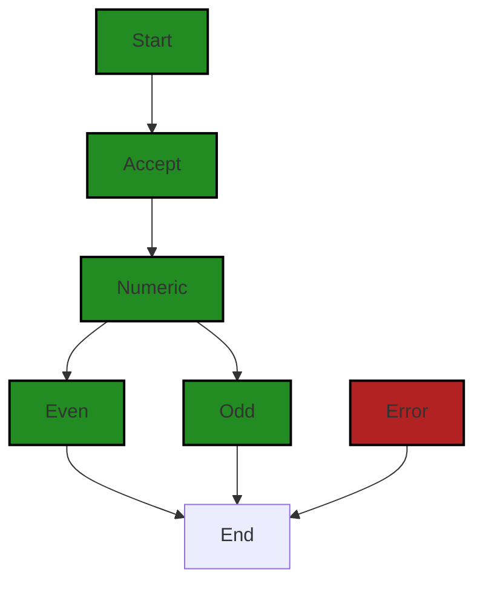

# Polyverse Boost-generated Source Analysis Details

## Source: ./even-odd.cbl
Date Generated: Saturday, October 21, 2023 at 12:32:51 PM PDT


---

### Boost Architectural Quick Summary Security Report

Last Updated: Saturday, October 21, 2023 at 12:32:14 PM PDT


Executive Report:

1. **Architectural Impact**: The analysis of this file has not revealed any severe issues.
2. **Risk Analysis**: The analysis of this file has not revealed any severe issues.
3. **Potential Customer Impact**: Based on the analysis, there are no severe issues that could potentially impact customers.
4. **Performance Issues**: Our analysis did not identify any explicit performance issues in the file.
5. **Risk Assessment**: Based on the current analysis of this file, no severe issues have been found. However, this doesn't guarantee that the file is risk-free.

Highlights:

- No severe issues were identified in the current analysis of this file.


---

### Boost Architectural Quick Summary Performance Report

Last Updated: Saturday, October 21, 2023 at 12:32:42 PM PDT


Executive Report:

1. **Architectural Impact**: The analysis of this file has not revealed any severe issues.
2. **Risk Analysis**: The analysis of this file has not revealed any severe issues.
3. **Potential Customer Impact**: Based on the analysis, there are no severe issues that could potentially impact customers.
4. **Performance Issues**: Our analysis did not identify any explicit performance issues in the file.
5. **Risk Assessment**: Based on the current analysis of this file, no severe issues have been found. However, this doesn't guarantee that the file is risk-free.

Highlights:

- No severe issues were identified in the current analysis of this file.


---

### Boost Architectural Quick Summary Compliance Report

Last Updated: Saturday, October 21, 2023 at 12:32:55 PM PDT


Executive Report:

1. **Architectural Impact**: The analysis of this file has not revealed any severe issues.
2. **Risk Analysis**: The analysis of this file has not revealed any severe issues.
3. **Potential Customer Impact**: Based on the analysis, there are no severe issues that could potentially impact customers.
4. **Performance Issues**: Our analysis did not identify any explicit performance issues in the file.
5. **Risk Assessment**: Based on the current analysis of this file, no severe issues have been found. However, this doesn't guarantee that the file is risk-free.

Highlights:

- No severe issues were identified in the current analysis of this file.

---
## Detailed Analysis:

### Cell 0:
## Original Code:

### Programming Language: plaintext
### ./even-odd.cbl line 0

```plaintext
        IDENTIFICATION DIVISION.
        PROGRAM-ID. EVEN-ODD.
        DATA DIVISION.
        WORKING-STORAGE SECTION.
          01 CMDARGS PIC X(38).
          01 NUM     PIC S9(30).
        PROCEDURE DIVISION.
           ACCEPT CMDARGS FROM COMMAND-LINE.
           IF CMDARGS IS ALPHABETIC THEN
              DISPLAY "Usage: please input a number"
              STOP RUN.
           COMPUTE NUM = FUNCTION NUMVAL(CMDARGS).
           IF NUM IS NUMERIC THEN
              IF FUNCTION MOD (NUM, 2) = 0 THEN
                 DISPLAY "Even"
              ELSE
                 DISPLAY "Odd"
           ELSE 
              DISPLAY "Usage: please input a number"
           STOP RUN.

```
## Boost Analysis:


---

### Boost Code Explanation

Last Updated: Saturday, October 21, 2023 at 12:31:47 PM PDT

This code is written in COBOL (Common Business-Oriented Language), a compiled English-like computer programming language designed for business use. COBOL is primarily used in business, finance, and administrative systems for companies and governments.

The code is for a simple program that checks if a number is even or odd. Here's a breakdown of what the code does:

1. The `IDENTIFICATION DIVISION` and `PROGRAM-ID` are basic parts of a COBOL program. They simply identify the program. In this case, the program is named `EVEN-ODD`.

2. The `DATA DIVISION` and `WORKING-STORAGE SECTION` define the data items that the program will use. In this case, there are two data items: `CMDARGS` and `NUM`. `CMDARGS` is a string of up to 38 characters, and `NUM` is a signed integer of up to 30 digits.

3. The `PROCEDURE DIVISION` contains the executable part of the program.

4. The `ACCEPT CMDARGS FROM COMMAND-LINE.` statement gets the command-line argument and stores it in `CMDARGS`.

5. The program then checks if `CMDARGS` is alphabetic. If it is, the program displays a usage message and then stops.

6. If `CMDARGS` is not alphabetic, the program uses the `FUNCTION NUMVAL` to convert `CMDARGS` to a numeric value and stores it in `NUM`.

7. The program then checks if `NUM` is numeric. If it is not, the program displays a usage message and then stops.

8. If `NUM` is numeric, the program checks if `NUM` is even by using the `FUNCTION MOD` to calculate the remainder of `NUM` divided by 2. If the remainder is 0, the program displays "Even". Otherwise, it displays "Odd".

The algorithm used in this program is the modulo operation to determine whether a number is even or odd. The modulo operation finds the remainder after division of one number by another (sometimes called modulus).

In terms of the architectural guidelines, as there are no additional special architectural guidelines or constraints mentioned for this software project, this code appears to be consistent with general good coding practices.

For more information on COBOL, you can refer to this link: https://en.wikipedia.org/wiki/COBOL 

For more details on the modulo operation, you can refer to this link: https://en.wikipedia.org/wiki/Modulo_operation


---

### Boost Flow Diagram

Last Updated: Saturday, October 21, 2023 at 12:32:00 PM PDT



The control flow graph for the given source code is as follows:

- The program starts at the "Start" node.
- The program then goes to the "Accept" node, where it accepts the command line arguments.
- From the "Accept" node, the program goes to the "Numeric" node, where it checks if the command line argument is numeric.
- If the command line argument is numeric, the program goes to the "Even" node if the number is even, and to the "Odd" node if the number is odd.
- From the "Even" and "Odd" nodes, the program goes to the "End" node, where it displays the result.
- If the command line argument is not numeric, the program goes to the "Error" node, where it displays an error message.
- From the "Error" node, the program also goes to the "End" node.

This control flow graph represents the primary path through the code, as well as the alternate non-error paths and the error path.


---

### Boost Source-Level Security Analysis

Last Updated: Saturday, October 21, 2023 at 12:32:10 PM PDT

**No bugs found**


---

### Boost Source-Level Performance Analysis

Last Updated: Saturday, October 21, 2023 at 12:32:38 PM PDT

1. **Severity**: 2/10

   **Line Number**: 10

   **Bug Type**: CPU

   **Description**: The program is using the FUNCTION NUMVAL to convert the command line input to a number. This function provides a lot of flexibility, but it is also relatively slow compared to other methods of converting strings to numbers.

   **Solution**: If you know that the input will always be a valid integer, you could use the FUNCTION INTEGER-OF instead, which is faster. However, this would not handle invalid input as gracefully, so you would need to add additional error checking.


2. **Severity**: 2/10

   **Line Number**: 12

   **Bug Type**: CPU

   **Description**: The program is using the FUNCTION MOD to determine if a number is even or odd. This is a relatively slow operation, especially for large numbers.

   **Solution**: A faster way to determine if a number is even or odd is to check the least significant bit. If the least significant bit is 0, the number is even; if it is 1, the number is odd. This can be done using bitwise AND operation with 1 (NUM AND 1).


---

### Boost Source-Level Data and Privacy Compliance Analysis

Last Updated: Saturday, October 21, 2023 at 12:32:51 PM PDT

**No bugs found**

