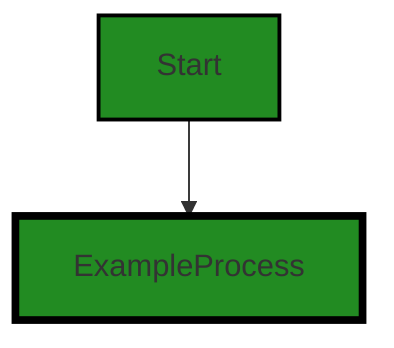

# Polyverse Boost-generated Source Analysis Details

## Source: ./hello-world.cbl
Date Generated: Saturday, October 21, 2023 at 12:22:18 PM PDT


---

### Boost Architectural Quick Summary Security Report

Last Updated: Saturday, October 21, 2023 at 12:21:42 PM PDT


Executive Report:

1. **Architectural Impact**: The analysis of this file has not revealed any severe issues.
2. **Risk Analysis**: The analysis of this file has not revealed any severe issues.
3. **Potential Customer Impact**: Based on the analysis, there are no severe issues that could potentially impact customers.
4. **Performance Issues**: Our analysis did not identify any explicit performance issues in the file.
5. **Risk Assessment**: Based on the current analysis of this file, no severe issues have been found. However, this doesn't guarantee that the file is risk-free.

Highlights:

- No severe issues were identified in the current analysis of this file.


---

### Boost Architectural Quick Summary Performance Report

Last Updated: Saturday, October 21, 2023 at 12:22:01 PM PDT


Executive Report:

1. **Architectural Impact**: The analysis of this file has not revealed any severe issues.
2. **Risk Analysis**: The analysis of this file has not revealed any severe issues.
3. **Potential Customer Impact**: Based on the analysis, there are no severe issues that could potentially impact customers.
4. **Performance Issues**: Our analysis did not identify any explicit performance issues in the file.
5. **Risk Assessment**: Based on the current analysis of this file, no severe issues have been found. However, this doesn't guarantee that the file is risk-free.

Highlights:

- No severe issues were identified in the current analysis of this file.


---

### Boost Architectural Quick Summary Compliance Report

Last Updated: Saturday, October 21, 2023 at 12:22:21 PM PDT


Executive Report:

1. **Architectural Impact**: The analysis of this file has not revealed any severe issues.
2. **Risk Analysis**: The analysis of this file has not revealed any severe issues.
3. **Potential Customer Impact**: Based on the analysis, there are no severe issues that could potentially impact customers.
4. **Performance Issues**: Our analysis did not identify any explicit performance issues in the file.
5. **Risk Assessment**: Based on the current analysis of this file, no severe issues have been found. However, this doesn't guarantee that the file is risk-free.

Highlights:

- No severe issues were identified in the current analysis of this file.

---
## Detailed Analysis:

### Cell 0:
## Original Code:

### Programming Language: plaintext
### ./hello-world.cbl line 0

```plaintext
        IDENTIFICATION DIVISION.
        PROGRAM-ID. HELLO-WORLD.
        PROCEDURE DIVISION.
            DISPLAY "Hello, World!"
        STOP RUN.

```
## Boost Analysis:


---

### Boost Code Explanation

Last Updated: Saturday, October 21, 2023 at 12:21:04 PM PDT

The code you provided is written in COBOL (Common Business-Oriented Language). COBOL is a high-level programming language first developed by the CODASYL Committee (Conference on Data Systems Languages) in the early 1960s. It was designed for business data processing needs and is still in use in many financial and business applications today.

Here's a breakdown of the code:

```
IDENTIFICATION DIVISION.
```
This is a mandatory division in every COBOL program. It identifies the program.

```
PROGRAM-ID. HELLO-WORLD.
```
This is a mandatory paragraph in the IDENTIFICATION DIVISION. It gives the program a name, in this case, "HELLO-WORLD".

```
PROCEDURE DIVISION.
```
This is where the actual code that the computer will execute is written. It is also a mandatory division in every COBOL program.

```
DISPLAY "Hello, World!"
```
This is a simple command that outputs the string "Hello, World!" to the console.

```
STOP RUN.
```
This statement is used to stop the program.

The algorithm used in this code is extremely simple: it just displays a message and then ends. There is no complex computation or data manipulation.

As for the architectural guidelines, since there were no special guidelines or constraints provided, this code doesn't conflict with any. It is a simple, standalone program, and doesn't interact with any other systems or software.

For more information and education on COBOL, you can visit the following link: [COBOL programming - tutorials, lectures, exercises, examples](https://www.mainframes.com/Cobol.html)


---

### Boost Flow Diagram

Last Updated: Saturday, October 21, 2023 at 12:21:21 PM PDT


The control flow graph for the given source code is a simple linear flow. The program starts at the "Start" node and proceeds to the "ExampleProcess" node, where the "DISPLAY" statement is executed to display the message "Hello, World!". After that, the program ends.


---

### Boost Source-Level Security Analysis

Last Updated: Saturday, October 21, 2023 at 12:21:38 PM PDT

**No bugs found**


---

### Boost Source-Level Performance Analysis

Last Updated: Saturday, October 21, 2023 at 12:21:58 PM PDT

**No bugs found**


---

### Boost Source-Level Data and Privacy Compliance Analysis

Last Updated: Saturday, October 21, 2023 at 12:22:18 PM PDT

**No bugs found**

