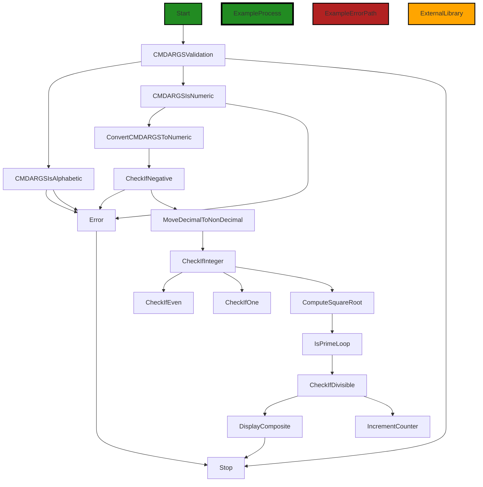

# Polyverse Boost-generated Source Analysis Details

## Source: ./prime-number.cbl
Date Generated: Saturday, October 21, 2023 at 12:25:50 PM PDT


---

### Boost Architectural Quick Summary Security Report

Last Updated: Saturday, October 21, 2023 at 12:25:12 PM PDT


Executive Report:

1. **Architectural Impact**: The analysis of this file has not revealed any severe issues.
2. **Risk Analysis**: The analysis of this file has not revealed any severe issues.
3. **Potential Customer Impact**: Based on the analysis, there are no severe issues that could potentially impact customers.
4. **Performance Issues**: Our analysis did not identify any explicit performance issues in the file.
5. **Risk Assessment**: Based on the current analysis of this file, no severe issues have been found. However, this doesn't guarantee that the file is risk-free.

Highlights:

- No severe issues were identified in the current analysis of this file.


---

### Boost Architectural Quick Summary Performance Report

Last Updated: Saturday, October 21, 2023 at 12:25:41 PM PDT


Executive Report:

1. **Architectural Impact**: The analysis of this file has not revealed any severe issues.
2. **Risk Analysis**: The analysis of this file has not revealed any severe issues.
3. **Potential Customer Impact**: Based on the analysis, there are no severe issues that could potentially impact customers.
4. **Performance Issues**: Our analysis did not identify any explicit performance issues in the file.
5. **Risk Assessment**: Based on the current analysis of this file, no severe issues have been found. However, this doesn't guarantee that the file is risk-free.

Highlights:

- No severe issues were identified in the current analysis of this file.


---

### Boost Architectural Quick Summary Compliance Report

Last Updated: Saturday, October 21, 2023 at 12:25:53 PM PDT


Executive Report:

1. **Architectural Impact**: The analysis of this file has not revealed any severe issues.
2. **Risk Analysis**: The analysis of this file has not revealed any severe issues.
3. **Potential Customer Impact**: Based on the analysis, there are no severe issues that could potentially impact customers.
4. **Performance Issues**: Our analysis did not identify any explicit performance issues in the file.
5. **Risk Assessment**: Based on the current analysis of this file, no severe issues have been found. However, this doesn't guarantee that the file is risk-free.

Highlights:

- No severe issues were identified in the current analysis of this file.

---
## Detailed Analysis:

### Cell 0:
## Original Code:

### Programming Language: plaintext
### ./prime-number.cbl line 0

```plaintext
        IDENTIFICATION DIVISION.
        PROGRAM-ID. PRIME-NUMBER.
        DATA DIVISION.
        WORKING-STORAGE SECTION.
          01 CMDARGS     PIC X(38).
          01 DECINUM     PIC S9999v99.
          01 NUM         PIC S9(7).
          01 SQRT        PIC 9(7).
          01 CNT         PIC 9(7) VALUE 3.
          01 PRIME       PIC 9(1) VALUE 0.
        PROCEDURE DIVISION.
           ACCEPT CMDARGS FROM COMMAND-LINE.

           IF CMDARGS IS ALPHABETIC THEN
              PERFORM ERROR-PARA.
           
      * Convert CMDARGS to it's cumeric value
           COMPUTE DECINUM = FUNCTION NUMVAL(CMDARGS).
           
           IF DECINUM < 0 THEN
              PERFORM ERROR-PARA.

      * Move the Decimal number to Non decimal number
           MOVE DECINUM TO NUM
      
      * If both are equal, then it was an integer
           IF NUM IS EQUAL TO DECINUM THEN
              IF FUNCTION MOD (NUM, 2) = 0 AND NUM IS NOT EQUAL TO 2
                 PERFORM DISPLAY-COMPOSITE
              ELSE IF NUM IS EQUAL TO 1
                 PERFORM DISPLAY-COMPOSITE
              ELSE
                 COMPUTE SQRT = NUM ** 0.5
                 PERFORM ISPRIME UNTIL CNT > SQRT
                 DISPLAY "Prime"
                 STOP RUN
           ELSE 
              PERFORM ERROR-PARA.
           
           
          ISPRIME.
            IF FUNCTION MOD (NUM, CNT) = 0 THEN
               PERFORM DISPLAY-COMPOSITE
            ELSE
               COMPUTE CNT = CNT + 1
            END-IF.
           
          DISPLAY-COMPOSITE.
            DISPLAY "Composite"
            STOP RUN.

          ERROR-PARA.
           DISPLAY "Usage: please input a non-negative integer".
           STOP RUN.

```
## Boost Analysis:


---

### Boost Code Explanation

Last Updated: Saturday, October 21, 2023 at 12:24:39 PM PDT

This is a program written in COBOL (COmmon Business-Oriented Language), a high-level programming language for business applications. This particular program is designed to check if a number given as a command line argument is a prime number.

Here's a step-by-step breakdown of the program:

1. The program begins with the `IDENTIFICATION DIVISION` and `PROGRAM-ID`, which are standard COBOL program headers.

2. The `DATA DIVISION` and `WORKING-STORAGE SECTION` define the variables that will be used in the program.

3. The `PROCEDURE DIVISION` is where the main logic of the program is implemented.

4. The program accepts a command line argument (`CMDARGS`) and checks if it is alphabetic. If it is, the program calls the `ERROR-PARA` routine, which displays an error message and stops the program.

5. If `CMDARGS` is not alphabetic, it is converted to a numeric value (`DECINUM`) using the `FUNCTION NUMVAL` function. If `DECINUM` is less than 0, the program calls the `ERROR-PARA` routine.

6. The decimal number `DECINUM` is then moved to a non-decimal number `NUM`. If `NUM` and `DECINUM` are equal, it means that the input was an integer.

7. The program then checks if the number is divisible by 2 and not equal to 2, or if the number is 1. In either case, the number is not prime, so the program calls the `DISPLAY-COMPOSITE` routine, which displays "Composite" and stops the program.

8. If the number is not divisible by 2 (or is 2) and is not 1, the program calculates the square root of the number and checks if the number is divisible by any odd number up to the square root. If it is, the program calls the `DISPLAY-COMPOSITE` routine. If it isn't, the program displays "Prime" and stops.

9. If `NUM` and `DECINUM` are not equal, meaning the input was not an integer, the program calls the `ERROR-PARA` routine.

The algorithm used here is a basic prime-checking algorithm. It checks divisibility by 2 and then checks divisibility by odd numbers up to the square root of the number. This is a simple and efficient algorithm for checking if a number is prime.

For more information on COBOL, you can refer to this link: [COBOL](https://en.wikipedia.org/wiki/COBOL)

For more information on prime-checking algorithms, you can refer to this link: [Prime Algorithms](https://en.wikipedia.org/wiki/Primality_test)


---

### Boost Flow Diagram

Last Updated: Saturday, October 21, 2023 at 12:24:59 PM PDT



The primary path through the code is as follows:
1. Start at the `CMDARGSValidation` block.
2. If `CMDARGS` is alphabetic, go to the `Error` block.
3. If `CMDARGS` is not alphabetic, check if it is numeric.
4. If `CMDARGS` is not numeric, go to the `Error` block.
5. If `CMDARGS` is numeric, convert it to a numeric value.
6. Check if the converted value is negative.
7. If the converted value is negative, go to the `Error` block.
8. If the converted value is not negative, move it to the `NUM` variable.
9. Check if `NUM` is an integer.
10. If `NUM` is not an integer, go to the `Error` block.
11. If `NUM` is an integer, check if it is even and not equal to 2.
12. If `NUM` is even and not equal to 2, go to the `DisplayComposite` block.
13. If `NUM` is not even and not equal to 2, check if it is equal to 1.
14. If `NUM` is equal to 1, go to the `DisplayComposite` block.
15. If `NUM` is not equal to 1, compute the square root of `NUM`.
16. Enter the `IsPrimeLoop` loop until `CNT` is greater than `SQRT`.
17. Check if `NUM` is divisible by `CNT`.
18. If `NUM` is divisible by `CNT`, go to the `DisplayComposite` block.
19. If `NUM` is not divisible by `CNT`, increment `CNT` and continue the loop.
20. Display "Prime" and stop the program.

The error path is as follows:
1. Start at the `CMDARGSValidation` block.
2. If `CMDARGS` is alphabetic, go to the `Error` block.
3. If `CMDARGS` is not alphabetic, check if it is numeric.
4. If `CMDARGS` is not numeric, go to the `Error` block.
5. If `CMDARGS` is numeric, convert it to a numeric value.
6. Check if the converted value is negative.
7. If the converted value is negative, go to the `Error` block.
8. If the converted value is not negative, move it to the `NUM` variable.
9. Check if `NUM` is an integer.
10. If `NUM` is not an integer, go to the `Error` block.
11. If `NUM` is an integer, check if it is even and not equal to 2.
12. If `NUM` is even and not equal to 2, go to the `DisplayComposite` block.
13. If `NUM` is not even and not equal to 2, check if it is equal to 1.
14. If `NUM` is equal to 1, go to the `DisplayComposite` block.
15. If `NUM` is not equal to 1, compute the square root of `NUM`.
16. Enter the `IsPrimeLoop` loop until `CNT` is greater than `SQRT`.
17. Check if `NUM` is divisible by `CNT`.
18. If `NUM` is divisible by `CNT`, go to the `DisplayComposite` block.
19. If `NUM` is not divisible by `CNT`, increment `CNT` and continue the loop.
20. Display "Prime" and stop the program.

Note: The external library or non-standard function is not identified in the provided source code.


---

### Boost Source-Level Security Analysis

Last Updated: Saturday, October 21, 2023 at 12:25:08 PM PDT

**No bugs found**


---

### Boost Source-Level Performance Analysis

Last Updated: Saturday, October 21, 2023 at 12:25:36 PM PDT

1. **Severity**: 4/10

   **Line Number**: 14

   **Bug Type**: CPU

   **Description**: The program checks if the input is alphabetic and then converts it to its numeric value. This can be optimized by first checking if it's numeric and then proceeding with the rest of the code.

   **Solution**: Check if the input is numeric at the start of the program. If it's not, display an error message and stop the program. This will save CPU cycles.


2. **Severity**: 5/10

   **Line Number**: 33

   **Bug Type**: CPU

   **Description**: The program is using a loop to check if a number is prime. This is an inefficient algorithm that can lead to high CPU usage for large numbers.

   **Solution**: Use a more efficient algorithm for checking if a number is prime. For example, you can use the Sieve of Eratosthenes algorithm which is more efficient for large numbers.


---

### Boost Source-Level Data and Privacy Compliance Analysis

Last Updated: Saturday, October 21, 2023 at 12:25:50 PM PDT

**No bugs found**

