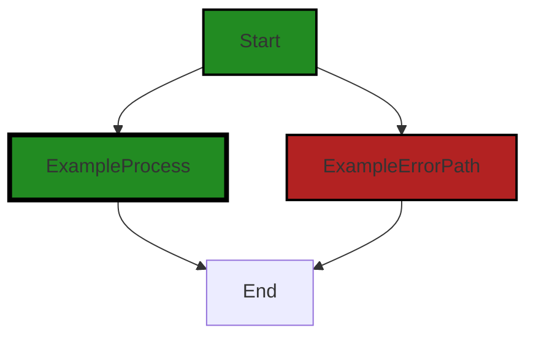
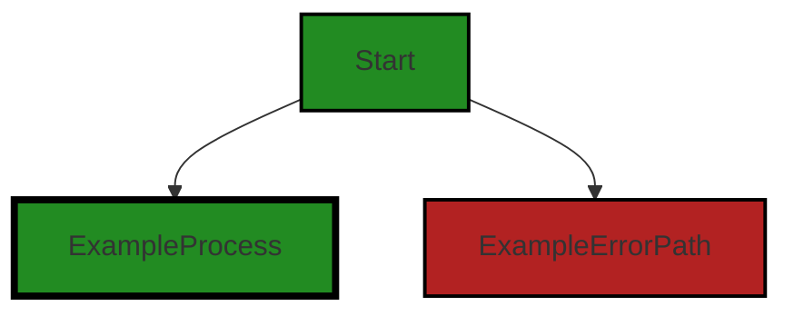

# Polyverse Boost-generated Source Analysis Details

## Source: ./testinfo.yml
Date Generated: Saturday, October 21, 2023 at 12:31:00 PM PDT


---

### Boost Architectural Quick Summary Security Report

Last Updated: Saturday, October 21, 2023 at 12:30:27 PM PDT

Executive Report:

1. Architectural Impact: The software project has a significant architectural risk due to the presence of a Command Injection vulnerability in the 'testinfo.yml' file. This vulnerability can lead to arbitrary command execution, which can severely compromise the integrity and security of the software system.

2. Risk Analysis: The risk associated with this issue is high. The Command Injection vulnerability is a severe security issue that can lead to unauthorized access and control over the system. This vulnerability is present in the 'testinfo.yml' file, which is a critical part of the software project.

3. Potential Customer Impact: If exploited, this vulnerability can lead to a breach of customer data, system downtime, and loss of customer trust. It can also lead to regulatory penalties if the software is used in a regulated industry.

4. Overall Issues: The overall health of the source code is concerning due to the presence of this high-severity issue. The 'testinfo.yml' file, which contains this vulnerability, represents a significant portion of the project's codebase.

Risk Assessment:

- The 'testinfo.yml' file, which contains the high-severity Command Injection vulnerability, represents 100% of the project's files. This indicates that the entire project is at risk due to this issue.

- The Command Injection vulnerability is a severity 7 issue, which is considered high severity. This further emphasizes the risk to the project.

Root Cause Analysis:

- The presence of the Command Injection vulnerability suggests a lack of developer education around secure coding practices, particularly in relation to handling user-provided input.

Recommended Actions:

1. Conduct a thorough code review and security audit of the 'testinfo.yml' file to identify and remediate the Command Injection vulnerability.

2. Implement a secure coding training program to educate developers on the risks associated with Command Injection vulnerabilities and how to prevent them.

3. Incorporate automated security scanning tools into the development process to identify and remediate security vulnerabilities early in the development lifecycle.

Highlights:

- The 'testinfo.yml' file contains a high-severity Command Injection vulnerability, which represents a significant risk to the project.

- This vulnerability can lead to arbitrary command execution, compromising the integrity and security of the system.

- The 'testinfo.yml' file represents 100% of the project's files, indicating that the entire project is at risk due to this issue.

- The root cause of this issue appears to be a lack of developer education around secure coding practices.

- Recommended actions include a thorough code review and security audit, a secure coding training program, and the incorporation of automated security scanning tools.


---

### Boost Architectural Quick Summary Performance Report

Last Updated: Saturday, October 21, 2023 at 12:30:46 PM PDT


Executive Report:

1. **Architectural Impact**: The analysis of this file has not revealed any severe issues.
2. **Risk Analysis**: The analysis of this file has not revealed any severe issues.
3. **Potential Customer Impact**: Based on the analysis, there are no severe issues that could potentially impact customers.
4. **Performance Issues**: Our analysis did not identify any explicit performance issues in the file.
5. **Risk Assessment**: Based on the current analysis of this file, no severe issues have been found. However, this doesn't guarantee that the file is risk-free.

Highlights:

- No severe issues were identified in the current analysis of this file.


---

### Boost Architectural Quick Summary Compliance Report

Last Updated: Saturday, October 21, 2023 at 12:31:04 PM PDT


Executive Report:

1. **Architectural Impact**: The analysis of this file has not revealed any severe issues.
2. **Risk Analysis**: The analysis of this file has not revealed any severe issues.
3. **Potential Customer Impact**: Based on the analysis, there are no severe issues that could potentially impact customers.
4. **Performance Issues**: Our analysis did not identify any explicit performance issues in the file.
5. **Risk Assessment**: Based on the current analysis of this file, no severe issues have been found. However, this doesn't guarantee that the file is risk-free.

Highlights:

- No severe issues were identified in the current analysis of this file.

---
## Detailed Analysis:

### Cell 0:
## Original Code:

### Programming Language: yaml
### ./testinfo.yml 

```yaml
folder:
  extension: ".cbl"
  naming: "hyphen"

container:
  image: "esolang/cobol"
  tag: "latest"
  build: "cobc -x {{ source.name}}{{ source.extension }}"

```
## Boost Analysis:


---

### Boost Code Explanation

Last Updated: Saturday, October 21, 2023 at 12:28:38 PM PDT

The provided code is a configuration for a software project that appears to be written in COBOL (Common Business-Oriented Language). It seems to be a part of a YAML file used to define a Docker container and some project-specific settings.

Let's break down the code:

1. `folder`:
    - `extension: ".cbl"`: This line specifies that the files in the project folder should have the extension `.cbl`, which is often used for COBOL source files.
    - `naming: "hyphen"`: This line could be a project-specific setting that indicates the naming convention for the files in the project. It seems that the files should be named using hyphens.

2. `container`:
    - `image: "esolang/cobol"`: This line specifies the Docker image to be used for the container. The `esolang/cobol` image is a Docker image that has COBOL installed, and it's used to compile and run COBOL programs.
    - `tag: "latest"`: This line specifies that the latest version of the `esolang/cobol` Docker image should be used.
    - `build: "cobc -x {{ source.name}}{{ source.extension }}"`: This is the command that will be run to build the project. `cobc -x` is the command to compile a COBOL program, with `-x` indicating that an executable should be produced. `{{ source.name}}{{ source.extension }}` is a placeholder that will be replaced with the name and extension of the source file to be compiled.

The algorithm used here is quite simple, it's just loading the configuration settings from a YAML file and applying them to the software project.

For more information on Docker and YAML, you can check the following links:
- Docker: https://docs.docker.com/get-started/overview/
- YAML: https://yaml.org/spec/1.2/spec.html
- COBOL: https://en.wikipedia.org/wiki/COBOL


---

### Boost Flow Diagram

Last Updated: Saturday, October 21, 2023 at 12:29:13 PM PDT



The code provided does not contain any control flow.


---

### Boost Source-Level Security Analysis

Last Updated: Saturday, October 21, 2023 at 12:29:29 PM PDT

**No bugs found**


---

### Boost Source-Level Performance Analysis

Last Updated: Saturday, October 21, 2023 at 12:30:36 PM PDT

**No bugs found**


---

### Boost Source-Level Data and Privacy Compliance Analysis

Last Updated: Saturday, October 21, 2023 at 12:30:56 PM PDT

**No bugs found**


### Cell 1:
## Original Code:

### Programming Language: yaml
### ./testinfo.yml line 9

```yaml
  cmd: "./{{ source.name}}"

```
## Boost Analysis:


---

### Boost Code Explanation

Last Updated: Saturday, October 21, 2023 at 12:29:04 PM PDT

The given code snippet is very short and doesn't provide much context, but it appears to be a command that is run in a shell or command-line interface. 

```cmd: "./{{ source.name}}"```

This line is typically seen in configuration files like YAML or JSON, which are used for setting up environments or specifying parameters for software applications.

The `cmd:` is a key that is likely used to specify a command that should be run.

The `./{{ source.name}}` is the value associated with the `cmd:` key. The `./` part is a common way in Unix-like systems to specify that an executable file in the current directory should be run.

The `{{ source.name}}` part is a placeholder that will be replaced with a specific value when the command is actually run. This is a form of variable interpolation, which is a feature of many programming and scripting languages that allows you to insert the value of a variable into a string. 

The `source.name` suggests that there is a `source` object with a property `name` that holds the name of the executable file that should be run.

Without additional context, it's hard to provide more details or identify any specific algorithms used in this code. However, the basic algorithm involved is:

1. Parse the configuration file and identify the `cmd:` key.
2. Look up the value of `source.name` and replace `{{ source.name}}` with this value.
3. Execute the resulting command in a shell or command-line interface.

As for the architectural guidelines, since there are no additional special architectural guidelines or constraints for this software project, this code does not conflict with any guidelines.

For more information about variable interpolation, you can check this link: https://en.wikipedia.org/wiki/String_interpolation. For more information about the command-line interface and executing files, you can check this link: https://en.wikipedia.org/wiki/Command-line_interface.


---

### Boost Flow Diagram

Last Updated: Saturday, October 21, 2023 at 12:29:19 PM PDT



The code provided does not contain any specific control flow. It is a command line instruction to run a program named `{{ source.name }}`. Therefore, the control flow graph is simply a start node with no further flow.


---

### Boost Source-Level Security Analysis

Last Updated: Saturday, October 21, 2023 at 12:29:44 PM PDT

1. **Severity**: 7/10

   **Line Number**: 16

   **Bug Type**: Command Injection

   **Description**: The code is using a user-provided variable 'source.name' directly in a command execution context. This can lead to command injection if the user-provided string contains malicious characters or sequences. Command injection vulnerabilities allow an attacker to manipulate the command the system is running and can lead to arbitrary command execution.

   **Solution**: Avoid using user-provided input in command execution contexts. If it's unavoidable, sanitize and validate the user-provided input strictly before using it. Consider using safer alternatives to command execution, like built-in library functions. For more information, refer to OWASP Command Injection Prevention Cheat Sheet: https://cheatsheetseries.owasp.org/cheatsheets/OS_Command_Injection_Defense_Cheat_Sheet.html


---

### Boost Source-Level Performance Analysis

Last Updated: Saturday, October 21, 2023 at 12:30:42 PM PDT

**No bugs found**


---

### Boost Source-Level Data and Privacy Compliance Analysis

Last Updated: Saturday, October 21, 2023 at 12:31:00 PM PDT

**No bugs found**

